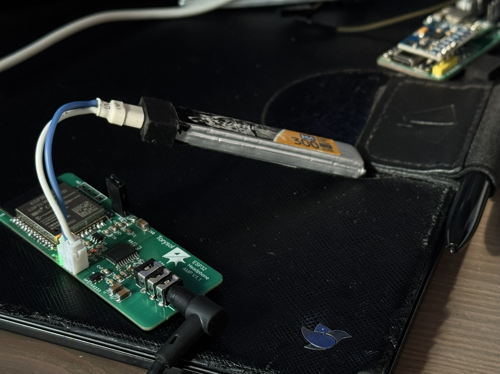

| Supported Targets | ESP32 |
| ----------------- | ----- |


## Firmware

I changed the code from arduino frame to esp-idf, because the later have more control over the low level. Code is based on expresslrs 
A2DP-SINK EXAMPLE, and modified to fit my hardware. 
The original source code can be found hear:

[A2DP-SINK EXAMPLE](https://github.com/espressif/esp-idf/tree/master/examples/bluetooth/bluedroid/classic_bt/a2dp_sink)

======================

This is the example of API implementing Advanced Audio Distribution Profile to receive an audio stream.

This example involves the use of Bluetooth legacy profile A2DP for audio stream reception, AVRCP for media information notifications, and I2S for audio stream output interface.

## How to use this example


### Hardware Required

I made my own board: ESP32 WROOM + PCM5102. The size is super small, only 60 by 30mm. It includes an onboard LDO and a 3.5mm headphone jack. It can be powered by a single 1s battery and is capable of driving low-impedance headphones.


| ESP pin   | I2S signal   |
| :-------- | :----------- |
| GPIO26    | LRCK (WS)    |
| GPIO25    | DATA         |
| GPIO33    | BCK (Clock)  |



### Configure the project

```
idf.py menuconfig
```

* Choose external I2S codec and configure the output PINs under A2DP Example Configuration


### Build and Flash

Build the project and flash it to the board, then run monitor tool to view serial output.

```
idf.py -p PORT build flash monitor
```

(To exit the serial monitor, type ``Ctrl-]``.)

## Example Output

After the program is started, the example starts inquiry scan and page scan, awaiting being discovered and connected. Other bluetooth devices such as smart phones can discover a device named "ESP_SPEAKER". A smartphone or another ESP-IDF example of A2DP source can be used to connect to the local device.

Once A2DP connection is set up, there will be a notification message with the remote device's bluetooth MAC address like the following:

```
I (106427) BT_AV: A2DP connection state: Connected, [64:a2:f9:69:57:a4]
```

If a smartphone is used to connect to local device, starting to play music with an APP will result in the transmission of audio stream. The transmitting of audio stream will be visible in the application log including a count of audio data packets, like this:

```
I (120627) BT_AV: A2DP audio state: Started
I (122697) BT_AV: Audio packet count 100
I (124697) BT_AV: Audio packet count 200
I (126697) BT_AV: Audio packet count 300
I (128697) BT_AV: Audio packet count 400
```

The output when receiving a cover art image:

```
I (53349) RC_CT: AVRC metadata rsp: attribute id 0x80, 1000748
I (53639) RC_CT: Cover Art Client final data event, image size: 14118 bytes
```

Also, the sound will be heard if a loudspeaker is connected and possible external I2S codec is correctly configured. For ESP32 A2DP source example, the sound is noise as the audio source generates the samples with a random sequence.


